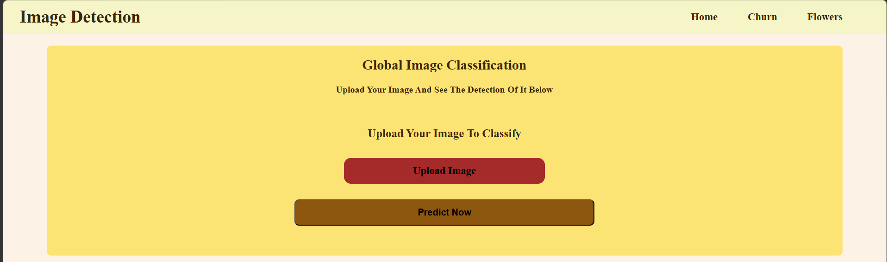
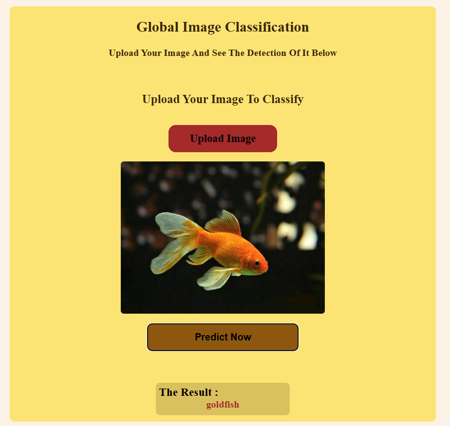
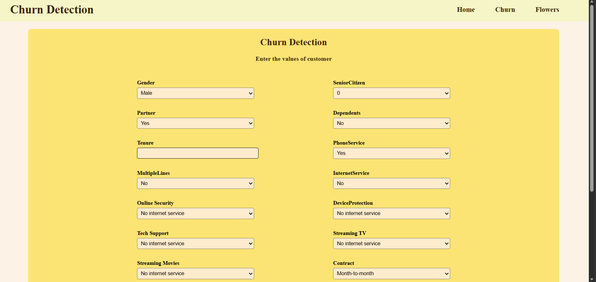
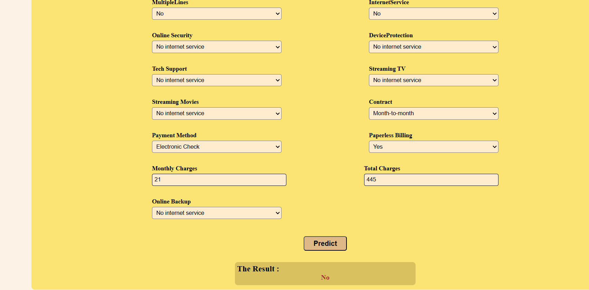
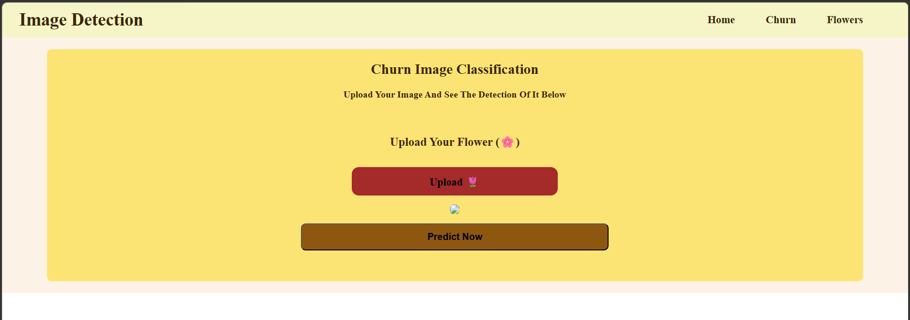
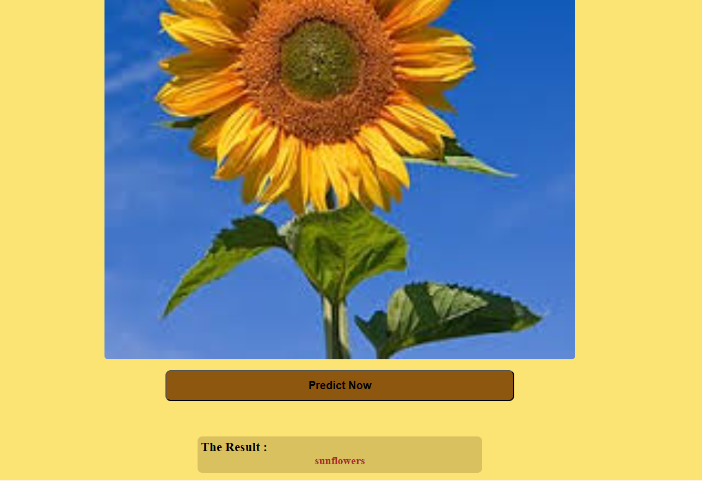

# Detectio Project

### Content

- Main Pages
- Tools
- Deployment
- Screen Shots
## Main Pages

- Website consist of 3 pages

### First Page
- First one for the detection of 1000 class like [tench
goldfish
great white shark
tiger shark
hammerhead
electric ray
stingray
cock
hen
ostrich
brambling
goldfinch
house finch
junco
indigo bunting
robin
bulbul
jay
magpie
chickadee
water ouzel
kite
bald eagle
vulture
great grey owl
European fire salamander
common newt]
- if you want to see all 1000 class you can open "labels.txt"
### Second Page

- It is a form to detect the churn and this data i get it from kaggle to train it on deep learning model use Dense Layers

- you just fill the form and click predict

### Third Page

- it is a page of detect the type of flowers just upload the image and click predict to see the results

# Tools 

- i have used tensorflow , keras , scikit-learn , cv2, and etc if you want to see all of them open "requirement.txt"

- these tool i have used them to train the models of prediction

- i used HTML,CSS to make the front end and user interface

- i used js and FASTAPI to connect the models and website together

# Deployment

- I used hugging face to host my api on it 
- I deployed the front end on the github

# Screen Shots

- this is the normal state

- when you upload the image

- the churn form

- the churn prediction

- flower model

